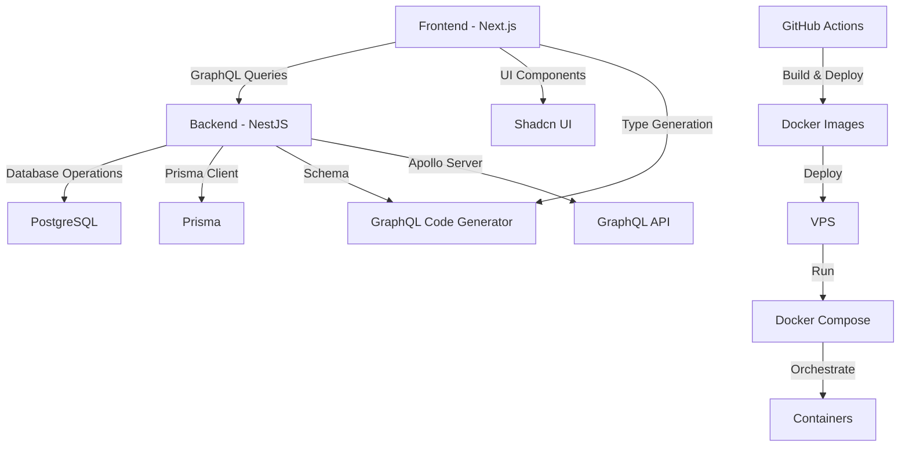

# System Patterns: SkillSwap

## Architecture Overview
- Monorepo structure with Next.js frontend and NestJS backend
- GraphQL API for flexible data querying
- PostgreSQL database with Prisma ORM
- Real-time messaging system
- Location-based services
- Docker-based deployment with GitHub Actions CI/CD
- VPS hosting with Docker Compose orchestration

## Core Components

### Frontend (Next.js)
- User authentication and profiles
- Skill/Item listing management
- Search and filtering interface
- Messaging system
- Location services integration
- Responsive design with Shadcn UI

### Backend (NestJS)
- User management
- Skill/Item catalog
- Matching algorithm
- Messaging system
- Location services
- Notification system

## Data Models

### User
- Profile information
- Skills inventory
- Item listings
- Reputation metrics
- Location data

### Exchange
- Offer/Request details
- Status tracking
- User ratings
- Communication history

### Message
- User conversations
- Exchange coordination
- System notifications

## Design Patterns
- Repository pattern for data access
- Service layer for business logic
- GraphQL resolvers for API
- Real-time updates with WebSocket
- CQRS for complex operations

## Security Patterns
- JWT authentication
- Role-based access control
- Input validation
- Rate limiting
- Data encryption

## Integration Points
- Location services API
- Email notification service
- Image storage service
- Payment gateway (future)
- Social media integration

## Component Relationships


## Key Technical Decisions
1. Monorepo structure for better code sharing and management
2. Apollo Server for GraphQL implementation
3. Prisma for database operations
4. TypeScript for type safety across the stack
5. Shadcn UI for consistent design system
6. GraphQL Code Generator for type-safe GraphQL operations
7. Dynamic module configuration for flexibility

## Code Organization
```
skillswap/
├── apps/
│   ├── web/          # Next.js frontend
│   │   ├── src/
│   │   └── codegen.ts # GraphQL Code Generator config
│   └── api/          # NestJS backend
│       ├── src/
│       │   ├── dynamic-modules/  # Dynamic module configurations
│       │   ├── users/           # User module
│       │   ├── hello/           # Hello module
│       │   └── app.module.ts    # Root module
├── package.json      # Root package configuration
└── memory-bank/      # Project documentation
``` 