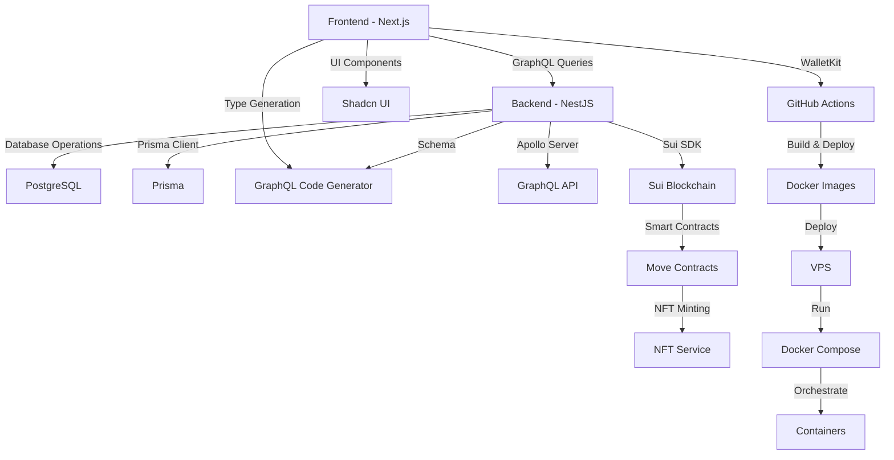

# System Patterns: SkillSwap

## Architecture Overview
- Monorepo structure with Next.js frontend and NestJS backend
- GraphQL API for flexible data querying
- PostgreSQL database with Prisma ORM
- Real-time messaging system
- Location-based services
- Sui blockchain integration
- NFT minting and verification
- Docker-based deployment with GitHub Actions CI/CD
- VPS hosting with Docker Compose orchestration

## Core Components

### Frontend (Next.js)
- Wallet connection and management
- User authentication and profiles
- Skill/Item listing management
- Search and filtering interface
- Messaging system
- Location services integration
- NFT display and verification
- Responsive design with Shadcn UI

### Backend (NestJS)
- User management
- Skill/Item catalog
- Matching algorithm
- Messaging system
- Location services
- Notification system
- Blockchain integration service
- NFT minting service

### Smart Contracts (Move)
- NFT contract for SkillBadges
- Deal verification contract
- User reputation contract

## Data Models

### User
- Wallet address
- Profile information
- Skills inventory
- Item listings
- NFT SkillBadge collection
- Location data

### Exchange
- Offer/Request details
- Status tracking
- User ratings
- Communication history
- NFT verification data

### Message
- User conversations
- Exchange coordination
- System notifications

### NFT
- SkillBadge metadata
- Minting information
- Verification status
- Owner history

## Design Patterns
- Repository pattern for data access
- Service layer for business logic
- GraphQL resolvers for API
- Real-time updates with WebSocket
- CQRS for complex operations
- Blockchain event listeners
- NFT minting queue
- Wallet connection manager

## Security Patterns
- Wallet-based authentication
- Role-based access control
- Input validation
- Rate limiting
- Data encryption
- Smart contract security
- NFT ownership verification

## Integration Points
- Location services API
- Email notification service
- Image storage service
- Sui blockchain network
- NFT marketplace
- Wallet providers

## Component Relationships


## Code Organization
```
skillswap/
├── apps/
│   ├── web/          # Next.js frontend
│   │   ├── src/
│   │   └── codegen.ts # GraphQL Code Generator config
│   ├── api/          # NestJS backend
│   │   ├── src/
│   │   │   ├── dynamic-modules/  # Dynamic module configurations
│   │   │   ├── users/           # User module
│   │   │   ├── blockchain/      # Blockchain integration
│   │   │   ├── nft/            # NFT service
│   │   │   └── app.module.ts    # Root module
│   └── contract/    # Move smart contracts
│       ├── sources/  # Contract source files
│       │   ├── skillswap.move   # Main contract module
│       │   ├── nft.move        # NFT implementation
│       │   └── deal.move       # Deal verification
│       ├── tests/    # Contract tests
│       │   ├── nft_tests.move  # NFT contract tests
│       │   └── deal_tests.move # Deal contract tests
│       └── Move.toml # Contract configuration
├── package.json      # Root package configuration
└── memory-bank/      # Project documentation
```

## Key Technical Decisions
1. Monorepo structure for better code sharing and management
2. Apollo Server for GraphQL implementation
3. Prisma for database operations
4. TypeScript for type safety across the stack
5. Shadcn UI for consistent design system
6. GraphQL Code Generator for type-safe GraphQL operations
7. Sui blockchain for NFT implementation
8. WalletKit for wallet integration
9. Move language for smart contracts
10. Modular contract design for better maintainability

## Code Organization
```
skillswap/
├── apps/
│   ├── web/          # Next.js frontend
│   │   ├── src/
│   │   └── codegen.ts # GraphQL Code Generator config
│   └── api/          # NestJS backend
│       ├── src/
│       │   ├── dynamic-modules/  # Dynamic module configurations
│       │   ├── users/           # User module
│       │   ├── blockchain/      # Blockchain integration
│       │   ├── nft/            # NFT service
│       │   └── app.module.ts    # Root module
├── contracts/        # Move smart contracts
│   ├── sources/     # Contract source files
│   └── tests/       # Contract tests
├── package.json      # Root package configuration
└── memory-bank/      # Project documentation
```

## Architecture Patterns

### Module Structure
- Each feature has its own module
- Modules contain:
  - Resolvers (GraphQL)
  - Services (Business Logic)
  - DTOs (Data Transfer Objects)
  - Entities (Database Models)

### Post System
- GraphQL-first approach
- Input validation using class-validator
- Service layer for business logic
- Prisma for database operations
- Error handling with custom exceptions

### Deal System
- Extends existing deal functionality
- NFT minting integration
- Transaction state management
- Status flow: PENDING → AGREED → COMPLETED
- Error handling for failed transactions

### NFT Integration
- Sui SDK integration
- Transaction handling
- Metadata storage
- Wallet connection
- Error recovery

## Implementation Patterns

### GraphQL Patterns
- Input types for mutations
- Response types for queries
- Field resolvers for relationships
- Error handling with custom types

### Service Patterns
- Dependency injection
- Transaction management
- Error handling
- Logging
- Validation

### Frontend Patterns
- Component composition
- State management
- Form handling
- Error boundaries
- Loading states

## Testing Strategy

### Backend Testing
- Unit tests for services
- Integration tests for resolvers
- E2E tests for API endpoints
- Mock Sui transactions

### Frontend Testing
- Component tests
- Integration tests
- E2E tests
- Mock API responses

## Error Handling

### Backend Errors
- Custom exception filters
- GraphQL error types
- Transaction rollback
- Error logging

### Frontend Errors
- Error boundaries
- Toast notifications
- Form validation
- Loading states

## Security Patterns

### Authentication
- JWT tokens
- Role-based access
- Wallet verification

### Authorization
- Resource ownership
- Role permissions
- Transaction signing

## Performance Patterns

### Backend
- Query optimization
- Caching
- Batch operations
- Connection pooling

### Frontend
- Code splitting
- Lazy loading
- Image optimization
- Caching

## Deployment Patterns

### Backend
- Docker containers
- Environment variables
- Database migrations
- Health checks

### Frontend
- Static generation
- API routes
- Environment configuration
- Build optimization

## Code Organization

### Backend Structure
```
apps/api/src/
├── posts/
│   ├── dto/
│   │   ├── create-post.input.ts
│   │   └── update-post.input.ts
│   ├── entities/
│   │   └── post.entity.ts
│   ├── posts.module.ts
│   ├── posts.resolver.ts
│   └── posts.service.ts
├── deals/
│   ├── dto/
│   │   ├── create-deal.input.ts
│   │   └── update-deal.input.ts
│   ├── entities/
│   │   └── deal.entity.ts
│   ├── deals.module.ts
│   ├── deals.resolver.ts
│   └── deals.service.ts
└── nft/
    ├── dto/
    │   └── mint-nft.input.ts
    ├── nft.module.ts
    ├── nft.resolver.ts
    └── nft.service.ts
```

### Frontend Structure
```
apps/web/src/
├── components/
│   ├── posts/
│   │   ├── CreatePost.tsx
│   │   ├── PostList.tsx
│   │   └── PostCard.tsx
│   ├── deals/
│   │   ├── DealRequest.tsx
│   │   ├── DealList.tsx
│   │   └── DealCard.tsx
│   └── nft/
│       ├── NFTList.tsx
│       ├── NFTCard.tsx
│       └── NFTDetails.tsx
└── pages/
    ├── posts/
    │   ├── index.tsx
    │   └── [id].tsx
    ├── deals/
    │   ├── index.tsx
    │   └── [id].tsx
    └── nft/
        ├── index.tsx
        └── [id].tsx
``` 